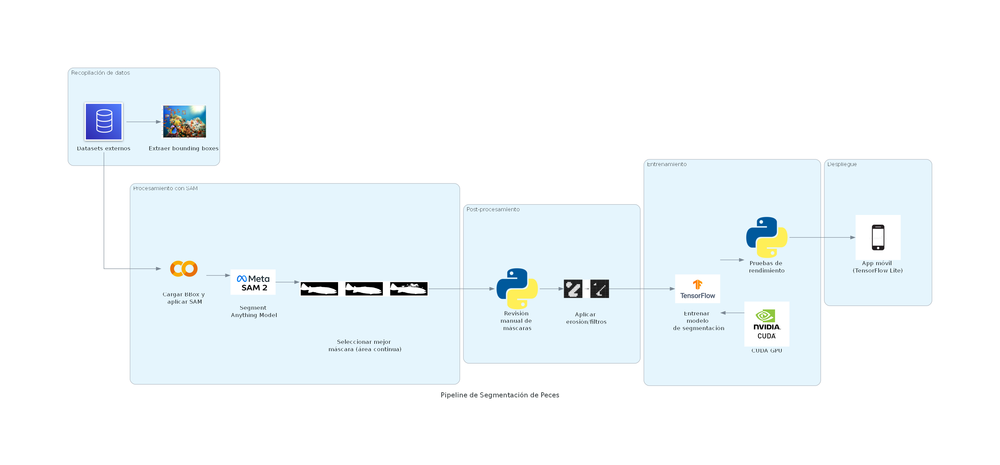

# 📌 Pipeline de Segmentación de Peces 🐟

Este proyecto implementa un pipeline de segmentación de peces utilizando el **Segment Anything Model (SAM)** de Meta y redes neuronales en **TensorFlow**. El modelo final se optimiza para su despliegue en dispositivos móviles mediante **TensorFlow Lite**.

## 🔄 Flujo del Proceso

### 1. Recopilación de Datos
- Se utilizan datasets externos que contienen imágenes de peces.
- Se extraen las *bounding boxes* (BBoxes) de los peces en las imágenes.

### 2. Procesamiento con SAM
- Se cargan las BBoxes en el **Segment Anything Model (SAM 2)**.
- SAM genera múltiples máscaras de segmentación para cada imagen.
- Se selecciona la mejor máscara basada en la continuidad del área segmentada.

### 3. Post-Procesamiento
- Se realiza una revisión manual de las máscaras generadas para asegurar su calidad.
- Se aplican técnicas de filtrado y erosión para refinar la segmentación.

### 4. Entrenamiento
- Se entrena un modelo de segmentación utilizando **TensorFlow** con aceleración en **CUDA GPU**.
- Se realizan pruebas de rendimiento para evaluar la precisión del modelo.

### 5. Despliegue
- El modelo optimizado se convierte a **TensorFlow Lite** para su implementación en una aplicación móvil.

## 🛠 Tecnologías Utilizadas

- **Meta SAM 2**: Segmentación automática de objetos en imágenes.
- **Python**: Procesamiento y manipulación de datos.
- **TensorFlow & CUDA**: Entrenamiento y optimización del modelo de segmentación.
- **TensorFlow Lite**: Despliegue del modelo en dispositivos móviles.

## 🚀 Objetivo del Proyecto

Este pipeline permite segmentar peces en imágenes de manera automatizada y eficiente, facilitando su uso en aplicaciones móviles para análisis marino y conservación.

## 📄 Licencia

Este proyecto está bajo la licencia [MIT](LICENSE).

---

📩 **Contacto:** braytonleonardo12@gmail.com Si tienes alguna pregunta o sugerencia, no dudes en abrir un *issue* o contribuir al proyecto.

